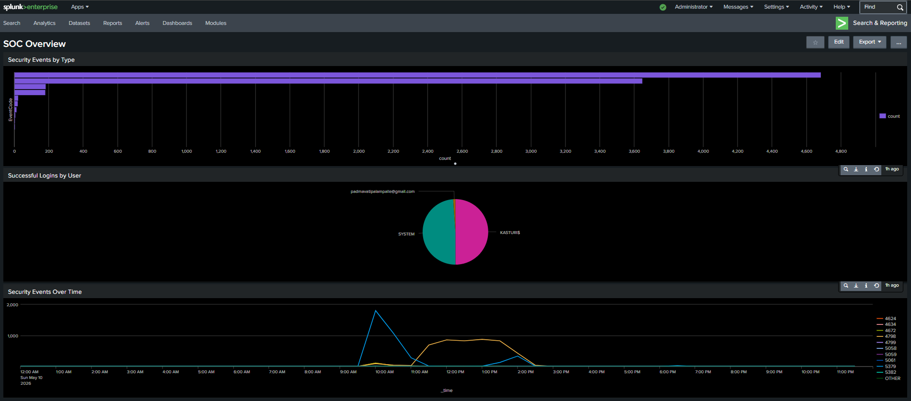

# SOC Splunk Lab — Security Monitoring Project

## Overview
Hands-on SOC analyst lab built using Splunk Enterprise. 
Ingested real Windows Security logs and performed threat 
detection analysis using SPL queries.

## What I Did
- Installed and configured Splunk Enterprise
- Ingested real Windows Security event logs (8,775 events)
- Wrote SPL queries to investigate security events
- Built a 3-panel SOC Overview dashboard

## Queries Written
- Security events by type
- Successful login analysis (EventCode 4624)
- Failed login / brute force detection (EventCode 4625)
- Admin privilege monitoring (EventCode 4672)
- Security events over time

## Dashboard

## Tools Used
- Splunk Enterprise (Free)
- Windows Event Viewer
- SPL (Search Processing Language)

## Author
Padmavati Palampalle | MSc Cybersecurity | NCI Dublin
